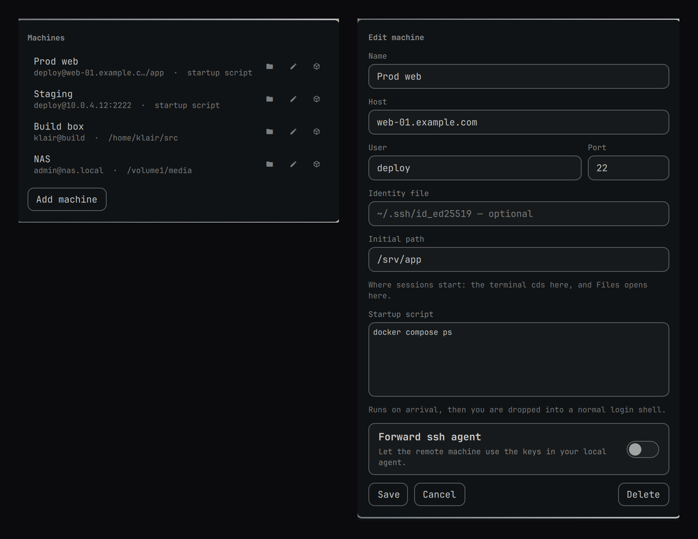

# Hop

Your SSH machines, in the Omarchy bar. Pick one and it opens in your default
terminal, runs the startup script you gave it, and leaves you at a prompt.



## What it does

- A bar icon listing every machine you have saved.
- Click one and `ssh` runs in the terminal `xdg-terminal-exec` would pick —
  the same one every other Omarchy launcher uses.
- Sessions outlive the bar. The window is handed to systemd rather than kept
  as a child of the shell process, so restarting the shell, updating Omarchy,
  or opening a second machine leaves the sessions you already have alone.
- Each machine can carry a **startup script**: a shell snippet that runs the
  moment you arrive (`cd /srv/app && docker compose ps`, `tmux attach`,
  whatever). When it finishes you are dropped into a normal login shell
  rather than disconnected.
- Adding, editing and removing machines happens in the panel, or from the
  `hop` CLI, or by editing one JSON file.

## What it deliberately does not do

**It never stores a password.** The terminal it opens gets a real tty, so ssh
prompts you there exactly as it would if you had typed the command yourself.
That keeps keys, agents, `ProxyJump`, `Match` blocks and everything else in
`~/.ssh/config` working, and it means this plugin has no secret to leak — the
machine list is just hostnames.

If you want passwordless logins, the answer is `ssh-copy-id`, not a plugin
holding your password inside a long-lived desktop process.

## Requirements

Everything here ships with Omarchy; the list is for completeness.

| | |
|---|---|
| `openssh` | The sessions. |
| `jq` | The CLI reads and writes the store with it. |
| `python` | Safely opens, validates and size-caps the store before parsing. |
| `nautilus` + `gvfs` | Only for the Files button. Without them the rest still works. |

## Install

```bash
omarchy plugin add https://github.com/perminder-klair/omarchy-hop.git --enable
```

Omarchy clones it to `~/.config/omarchy/plugins/co.klair.hop/` and asks before
enabling it, so you can read the code first. Updating is a fast-forward pull:

```bash
omarchy plugin update co.klair.hop
```

### Removing it

```bash
omarchy plugin remove co.klair.hop
```

That disables the plugin and deletes the checkout. Nothing else is touched —
no system files, no units, no `~/.ssh`. Your machine list survives in
`~/.config/hop/hosts.json`, so reinstalling picks up where you left off;
delete that directory too if you want it gone.

Hacking on it instead of just using it? See [CONTRIBUTING.md](CONTRIBUTING.md).

## Using it

Click the 󰒋 icon in the bar. **Add machine** opens the form:

| Field | Notes |
|-------|-------|
| Name | What the bar shows. Defaults to the host. |
| Host | Hostname, IP, or a `Host` alias from `~/.ssh/config`. |
| User | Leave empty to let `ssh_config` decide. |
| Port | 22 unless you say otherwise. |
| Identity file | Optional `-i`. `~` is expanded. |
| Initial path | Where sessions start: the terminal `cd`s here, and Files opens here. |
| Startup script | Runs on arrival, then hands you a login shell. |
| Forward ssh agent | `-A`. Off by default — only turn it on for machines you trust. |

In the list, each machine carries three buttons: the folder opens it in Files
over SFTP, the pencil edits it, and the last one copies the exact `ssh`
command to your clipboard.

### Browsing a machine in Files

The folder button hands Nautilus an `sftp://` URL, so browsing is gvfs's job,
not a mount this plugin manages. It gets its own connection and its own auth
prompt — you can browse a machine without a terminal session open, and
closing one does not disturb the other. gvfs ships with Omarchy, so there is
nothing to install.

gvfs does not expand `~` and cannot know what the remote home is, so with no
initial path set Hop sends `/home/<user>` (or `/root`, or `/` when no user
is configured). Set **Initial path** on any machine where that guess is
wrong — a NAS, a BSD box, a container.

### Startup scripts run in a login shell

`ssh host "some-command"` normally runs that command in a shell that is
neither a login shell nor interactive, so nothing on the far side that builds
`PATH` — `/etc/profile`, `~/.profile`, `~/.bashrc`, mise/asdf/nvm shims,
`~/.local/bin` — has run yet. Tools you use every day come back as
`command not found`.

Hop runs your script through `$SHELL -lc` instead, so it sees the same
environment an interactive login would, and the session you are handed
afterwards inherits it. If something still is not found, it is genuinely
missing from your login `PATH` on that machine — check with
`hop connect <name>` and `echo $PATH`.

## From the terminal

Everything the panel does goes through `bin/hop`, so it is all available
without the bar:

```bash
hop list
hop add --host 10.0.0.5 --name "Prod web" --user deploy --init 'cd /srv/app'
hop set <id> --port 2222
hop connect "Prod web"      # opens a terminal, same as clicking
hop files "Prod web"        # opens Files over SFTP
hop uri "Prod web"          # prints the sftp:// URL instead of opening it
hop command "Prod web"      # prints the ssh command instead of running it
hop rm "Prod web"
```

`--init-file some-script.sh` is there for startup scripts long enough that you
would rather keep them in a file.

## From a keybinding

The shell exposes an IPC target, so a machine is one hotkey away:

```
bindd = SUPER SHIFT, S, Prod web, exec, omarchy-shell hop connect "Prod web"
bindd = SUPER SHIFT, F, Prod web files, exec, omarchy-shell hop files "Prod web"
```

## Window rules

Sessions launch with app-id `org.omarchy.hop`, so Hyprland can treat them
differently from an ordinary terminal:

```
windowrule = workspace 4, class:^(org\.omarchy\.hop)$
```

## Where things live

| Path | What |
|------|------|
| `~/.config/hop/hosts.json` | The machine list. Plain JSON, safe to edit or sync. |
| `bin/hop` | The CLI the panel drives. |
| `bin/hop-read-store` | The bounded, descriptor-validated, field-checked store reader. |

Everything the bar reads goes through `bin/hop-read-store`, which caps how
many machines a store may hold and checks every field's type, length and range
before the shell sees it. Hand-edit the file if you like — an entry that does
not fit is dropped with a note on stderr rather than shown.

The store holds no secrets, but it is created `0600` inside a `0700`
directory anyway — a list of which machines you have and who you log in as is
not something to hand out either.

## License

MIT.
